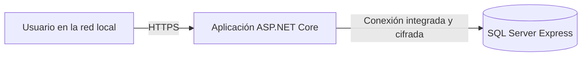
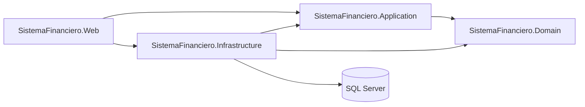

# Arquitectura

## Contexto de ejecución

En desarrollo, aplicación y SQL Server pueden ejecutarse en el mismo equipo. En producción, SQL Server
no se expondrá directamente a los navegadores ni se utilizará la cuenta `sa`.

## Arquitectura del software

### Responsabilidades

- **Domain:** entidades, objetos de valor, estados e invariantes financieras. No conoce MVC, Identity,
  EF Core ni SQL Server.
- **Application:** casos de uso, contratos, políticas y modelos de intercambio independientes de la UI.
- **Infrastructure:** Identity, EF Core, SQL Server, migraciones y servicios técnicos.
- **Web:** controladores, ViewModels, vistas Razor, autorización y composición de dependencias.

La solución es un monolito modular: se publica como una unidad, pero se organiza por capacidades del
negocio. No se utilizan microservicios, CQRS, MediatR, AutoMapper ni repositorios genéricos.

### Módulo de catálogos

El segundo incremento agrega clientes, proveedores, artículos de producto/servicio, categorías
financieras, cuentas financieras y tasas diarias dentro de las mismas capas. Cliente y proveedor son
entidades independientes; compartir datos de contacto no crea una identidad común implícita.

- Domain conserva estados e invariantes, sin atributos de MVC o EF Core.
- Application expone consultas paginadas y operaciones explícitas de mantenimiento.
- Infrastructure configura tablas, índices, restricciones, auditoría y concurrencia en SQL Server.
- Web utiliza ViewModels y políticas diferentes para consultar y modificar.

### Módulo de administración de usuarios

El tercer incremento conserva ASP.NET Core Identity como única implementación de credenciales y agrega
casos de uso explícitos en Application. Infrastructure coordina `UserManager`, roles fijos,
transacciones y una bitácora append-only; Web expone formularios cerrados únicamente al Administrador.

`ConcurrencyStamp` evita sobrescribir cambios administrativos consultados previamente y
`SecurityStamp` invalida cookies cuando cambian correo, rol, estado o contraseña. Una cuenta creada o
restablecida mantiene `MustChangePassword` hasta que su propietario cambia la credencial. Mientras ese
estado está activo, un middleware permite solamente el cambio de contraseña, el cierre de sesión y los
recursos anónimos necesarios para presentar la página. El sello se valida en cada solicitud autenticada:
el costo de una consulta adicional es aceptable para el volumen interno previsto y evita una ventana de
cinco minutos con permisos anteriores.

## Flujo de una solicitud

1. MVC recibe y valida la entrada destinada a la interfaz.
2. La política de autorización comprueba la capacidad del usuario.
3. Application coordina el caso de uso.
4. Domain valida las invariantes independientes de la interfaz.
5. Infrastructure ejecuta la transacción y persiste mediante EF Core.
6. Web presenta un resultado sin exponer detalles internos ni excepciones sensibles.

## Seguridad fundacional

- Identity propio, sin páginas públicas de registro o autoeliminación.
- Autenticación obligatoria de manera predeterminada.
- Contraseñas de al menos 12 caracteres y bloqueo por intentos fallidos.
- Cookies `HttpOnly`, `Secure` y `SameSite=Strict`.
- Formularios de escritura protegidos automáticamente contra CSRF.
- Políticas por capacidad; ocultar botones no reemplaza la validación del servidor.
- Primer administrador creado explícitamente desde secretos locales.
- Un rol fijo por usuario y administración interna exclusiva del rol Administrador.
- Contraseña temporal con cambio obligatorio antes de utilizar módulos funcionales.
- Sesiones anteriores invalidadas después de cambios sensibles.
- Bitácora de seguridad sin contraseñas, hashes ni tokens.

## Persistencia

- Un único `FinancialDbContext` para identidad y módulos financieros.
- Migraciones versionadas y aplicadas explícitamente.
- No se usa `EnsureCreated` ni migración automática al arrancar.
- Montos con `decimal`; nunca `float`, `double` o `money` de SQL Server.
- Precios unitarios de referencia con cuatro decimales y tasas con seis decimales declarados
  explícitamente; los importes monetarios finales continuarán redondeándose a dos decimales.
- Fechas de negocio usan `DateOnly`; instantes de auditoría, UTC.
- Las entidades mutables incorporan `rowversion`; un conflicto se informa al usuario y no sobrescribe
  silenciosamente cambios ajenos.
- Clientes, proveedores, productos/servicios, categorías y cuentas utilizan baja lógica. Las tasas se
  corrigen en su única fila por fecha y no poseen un estado activo/inactivo.
- Todos esos registros conservan creación, última modificación y usuario responsable.
- Las relaciones históricas y jerárquicas restringen el borrado en cascada.
- Operaciones confirmadas no tendrán borrado en cascada.

La cuenta financiera guarda identidad, código, tipo y moneda, pero no un saldo actual. Los saldos se
calcularán posteriormente a partir de movimientos confirmados y saldos iniciales controlados.

## Autorización de catálogos

| Capacidad | Administrador | Gerencia | Finanzas | Asistente |
|---|:---:|:---:|:---:|:---:|
| Consultar catálogos financieros | No | Sí | Sí | Sí |
| Mantener clientes y proveedores | No | No | Sí | Sí |
| Mantener productos, servicios y precios | No | No | Sí | No |
| Mantener categorías, cuentas y tasas | No | No | Sí | No |

Administrador conserva capacidades técnicas y no hereda acceso financiero automáticamente. Cada
acción de escritura valida la política en el servidor, además de ajustar la navegación visible.

## Autorización de usuarios

| Capacidad | Administrador | Gerencia | Finanzas | Asistente |
|---|:---:|:---:|:---:|:---:|
| Consultar y administrar usuarios | Sí | No | No | No |
| Asignar roles | Sí | No | No | No |
| Activar, desactivar y desbloquear | Sí | No | No | No |
| Restablecer una contraseña ajena | Sí | No | No | No |
| Cambiar la contraseña propia | Sí | Sí | Sí | Sí |
| Acceder a módulos financieros | No | Según política | Según política | Según política |

## Pruebas

- Unitarias para reglas de dominio y dependencias de arquitectura.
- Integración en memoria para el pipeline HTTP sin reemplazar pruebas futuras de persistencia.
- Integración contra una base SQL Server exclusiva para restricciones, migraciones y concurrencia de
  las entidades financieras.
- Aceptación con datos sintéticos o anonimizados.

Las decisiones y consecuencias están registradas en [`docs/decisiones`](decisiones/).
