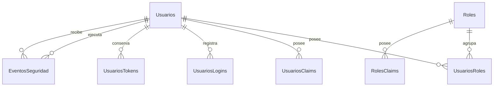
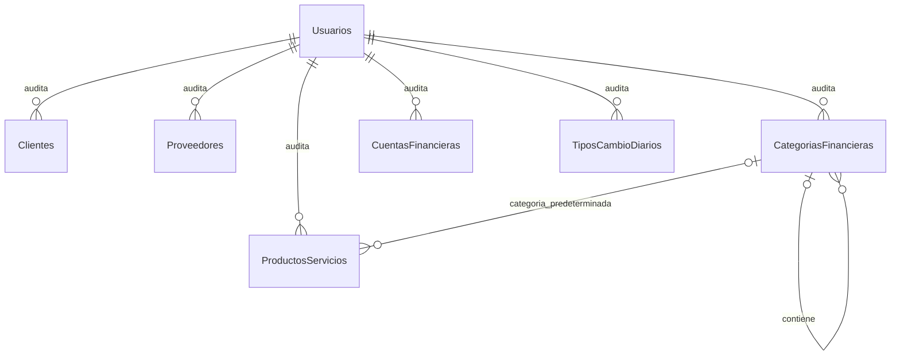

# Modelo de datos

## Convenciones iniciales

- Llaves primarias nuevas: `uniqueidentifier`/`Guid`.
- Tablas de seguridad: esquema SQL `seguridad`.
- Catálogos de partes y clasificación: esquema SQL `catalogos`.
- Cuentas y tipos de cambio: esquema SQL `finanzas`.
- Nombres únicos mediante valores normalizados de Identity.
- Precios de referencia: `decimal` con cuatro decimales declarados explícitamente.
- Tipo de cambio: `decimal` con seis decimales declarados explícitamente.
- Código monetario: CRC o USD.
- Instantes técnicos: UTC; fechas de documentos: fecha de negocio sin hora.
- Migraciones en `SistemaFinanciero.Infrastructure/Persistence/Migrations`.
- Códigos de catálogo recortados, normalizados a mayúsculas e indexados de forma única dentro de su
  propia tabla.
- Relaciones históricas y jerárquicas con borrado restringido.

## Esquema de seguridad implementado

La migración `InitialIdentity` crea las tablas de Identity y `AddUserAdministration` incorpora la
bitácora. El esquema resultante contiene:

### Diccionario de tablas

| Tabla | Propósito |
|---|---|
| `seguridad.Usuarios` | Identidad, credenciales hasheadas, bloqueo y estado lógico del usuario. |
| `seguridad.Roles` | Cuatro perfiles internos creados por el bootstrap explícito. |
| `seguridad.UsuariosRoles` | Relación muchos a muchos entre usuarios y roles. |
| `seguridad.UsuariosClaims` | Claims propios de un usuario, reservados para capacidades futuras. |
| `seguridad.RolesClaims` | Claims asociados a roles. |
| `seguridad.UsuariosLogins` | Metadatos de proveedores externos; no se usan en el alcance inicial. |
| `seguridad.UsuariosTokens` | Tokens generados por Identity. |
| `seguridad.EventosSeguridad` | Bitácora append-only de cambios administrativos de acceso, sin secretos. |
| `dbo.__EFMigrationsHistory` | Historial técnico de migraciones aplicadas. |

### `seguridad.Usuarios`

| Campo | Tipo SQL | Nulo | Restricción | Descripción |
|---|---|---:|---|---|
| `Id` | `uniqueidentifier` | No | PK | Identificador estable. |
| `FullName` | `nvarchar(150)` | No | — | Nombre mostrado y utilizado en trazabilidad. |
| `IsActive` | `bit` | No | Predeterminado 1 | Baja lógica; un usuario inactivo no accede. |
| `MustChangePassword` | `bit` | No | Predeterminado 0 | Restringe una contraseña temporal hasta que el propietario la cambia. |
| `UserName` | `nvarchar(256)` | No | Índice único normalizado | En esta versión coincide con el correo. |
| `NormalizedUserName` | `nvarchar(256)` | No | `UserNameIndex` único | Valor normalizado por Identity. |
| `Email` | `nvarchar(256)` | No | — | Correo utilizado para iniciar sesión. |
| `NormalizedEmail` | `nvarchar(256)` | No | `EmailIndex` único | Evita duplicados aun bajo concurrencia. |
| `EmailConfirmed` | `bit` | No | — | Marcador técnico; no hay servicio de correo. |
| `PasswordHash` | `nvarchar(max)` | Sí | — | Hash administrado exclusivamente por Identity. |
| `SecurityStamp` | `nvarchar(max)` | Sí | — | Permite invalidar sesiones ante cambios sensibles. |
| `ConcurrencyStamp` | `nvarchar(max)` | Sí | Concurrencia Identity | Detecta cambios concurrentes. |
| `PhoneNumber` | `nvarchar(max)` | Sí | — | Reservado por Identity; sin uso funcional inicial. |
| `PhoneNumberConfirmed` | `bit` | No | — | Reservado por Identity. |
| `TwoFactorEnabled` | `bit` | No | — | Reservado; MFA no forma parte del primer incremento. |
| `LockoutEnd` | `datetimeoffset` | Sí | — | Fin de un bloqueo temporal. |
| `LockoutEnabled` | `bit` | No | — | Habilita el control de intentos fallidos. |
| `AccessFailedCount` | `int` | No | — | Intentos fallidos acumulados por Identity. |

Las tablas auxiliares conservan las claves y relaciones definidas por ASP.NET Core Identity. Su esquema
exacto y reproducible está en la migración versionada; no deben editarse manualmente en SQL Server.

`ConcurrencyStamp` se presenta a la interfaz únicamente como una versión opaca. No se confunde con
`SecurityStamp`: el primero detecta formularios administrativos obsoletos y el segundo invalida cookies
después de cambios sensibles.

### `seguridad.EventosSeguridad`

| Campo | Tipo SQL | Nulo | Restricción | Descripción |
|---|---|---:|---|---|
| `Id` | `uniqueidentifier` | No | PK | Identificador inmutable del evento. |
| `Action` | `int` | No | Valor enumerado permitido | Alta, edición, rol, estado, contraseña, desbloqueo o bootstrap. |
| `ActorUserId` | `uniqueidentifier` | Sí | FK restrictiva | Administrador o propietario que ejecutó la acción; nulo solo para bootstrap. |
| `TargetUserId` | `uniqueidentifier` | No | FK restrictiva | Cuenta afectada por la acción. |
| `OccurredAtUtc` | `datetimeoffset` | No | UTC | Instante en que la transacción confirmó el cambio. |
| `Role` | `nvarchar(32)` | Sí | Rol fijo permitido | Rol nuevo cuando la acción necesita conservarlo. |

La entidad no posee operaciones de actualización o eliminación y no incluye campos para contraseña,
hash, token, correo, identificación ni información financiera. Los índices por instante, actor y
objetivo preparan la consulta futura de auditoría sin ampliar este incremento con un módulo de reportes.

## Modelo del incremento de catálogos

Cliente y proveedor son entidades separadas según ADR-0006. Las tablas financieras no almacenan
asientos contables, inventario ni un saldo editable de cuenta.

Cada relación de auditoría representa las referencias de creación y última modificación hacia
`seguridad.Usuarios`; nunca provoca borrado en cascada.

### Diccionario de tablas del incremento

| Tabla | Propósito |
|---|---|
| `catalogos.Clientes` | Personas u organizaciones a las que se puede facturar. |
| `catalogos.Proveedores` | Personas u organizaciones asociadas a gastos futuros. |
| `catalogos.ProductosServicios` | Catálogo facturable unificado, sin existencias de inventario. |
| `catalogos.CategoriasFinancieras` | Clasificación jerárquica de ingreso o gasto. |
| `finanzas.CuentasFinancieras` | Identificación de cajas y bancos con tipo y moneda inmutables. |
| `finanzas.TiposCambioDiarios` | Una tasa manual CRC por USD para cada fecha de negocio. |

### Campos comunes auditables

Clientes, proveedores, productos/servicios, categorías y cuentas comparten conceptualmente:

| Campo | Tipo SQL | Nulo | Restricción | Descripción |
|---|---|---:|---|---|
| `Id` | `uniqueidentifier` | No | PK | Identificador técnico estable. |
| `IsActive` | `bit` | No | Predeterminado 1 | Baja lógica; no elimina historia. |
| `CreatedAtUtc` | `datetimeoffset` | No | UTC | Instante de creación. |
| `CreatedByUserId` | `uniqueidentifier` | No | FK restrictiva | Usuario creador. |
| `UpdatedAtUtc` | `datetimeoffset` | No | UTC | Instante del último cambio. |
| `UpdatedByUserId` | `uniqueidentifier` | No | FK restrictiva | Usuario responsable del último cambio. |
| `RowVersion` | `rowversion` | No | Concurrencia | Evita sobrescrituras silenciosas. |

`finanzas.TiposCambioDiarios` posee los mismos campos de auditoría y `RowVersion`, pero no `IsActive`:
una tasa se corrige de forma auditada en la fila única de su fecha.

### `catalogos.Clientes` y `catalogos.Proveedores`

Ambas tablas tienen la misma forma inicial, pero no comparten identidad ni ciclo de vida:

| Campo | Tipo SQL | Nulo | Restricción | Descripción |
|---|---|---:|---|---|
| `Code` | `nvarchar(30)` | No | Único por tabla | Código visible normalizado en mayúsculas. |
| `Name` | `nvarchar(150)` | No | — | Nombre completo o razón social. |
| `Identification` | `nvarchar(50)` | Sí | Único por tabla cuando existe | Identificación fiscal o personal cuando se conoce. |
| `Email` | `nvarchar(254)` | Sí | — | Correo de contacto. |
| `Phone` | `nvarchar(30)` | Sí | — | Teléfono de contacto. |
| `Address` | `nvarchar(500)` | Sí | — | Dirección administrativa. |

La misma identificación puede existir en ambas tablas porque una persona puede cumplir ambos papeles.
Cambiar un registro no actualiza silenciosamente el otro.

### `catalogos.ProductosServicios`

| Campo | Tipo SQL | Nulo | Restricción | Descripción |
|---|---|---:|---|---|
| `Code` | `nvarchar(30)` | No | Único | Código visible normalizado. |
| `Name` | `nvarchar(150)` | No | — | Nombre facturable. |
| `Type` | Valor restringido | No | Producto/Servicio | Clasifica el artículo; no habilita inventario. |
| `Description` | `nvarchar(500)` | Sí | — | Descripción administrativa. |
| `UnitOfMeasure` | `nvarchar(30)` | No | — | Unidad visible para capturas futuras. |
| `ReferencePriceCrc` | `decimal(18,4)` | Sí | Mayor que cero | Precio de referencia en CRC. |
| `ReferencePriceUsd` | `decimal(18,4)` | Sí | Mayor que cero | Precio de referencia en USD. |
| `DefaultIncomeCategoryId` | `uniqueidentifier` | Sí | FK restrictiva | Categoría activa de ingreso sugerida; no obliga documentos futuros. |

Ambos precios pueden ser nulos para servicios de precio variable. Cuando existe un precio se conserva
con cuatro decimales; el redondeo del total monetario se realizará al crear documentos.

### `catalogos.CategoriasFinancieras`

| Campo | Tipo SQL | Nulo | Restricción | Descripción |
|---|---|---:|---|---|
| `Code` | `nvarchar(30)` | No | Único | Código visible normalizado. |
| `Name` | `nvarchar(120)` | No | — | Nombre de la categoría. |
| `Kind` | Valor restringido | No | Ingreso/Gasto; inmutable | Naturaleza financiera administrativa. |
| `ParentId` | `uniqueidentifier` | Sí | FK autorreferente restrictiva | Categoría padre del mismo tipo. |
| `Description` | `nvarchar(300)` | Sí | — | Explicación de uso. |

La aplicación impide autorreferencias, ciclos y padres de un tipo distinto. También bloquea la baja de
una categoría con hijas activas o artículos activos que la usan, y exige un padre activo al reactivar
una hija. No hay desactivación en cascada. La base restringe el borrado para conservar la jerarquía.

### `finanzas.CuentasFinancieras`

| Campo | Tipo SQL | Nulo | Restricción | Descripción |
|---|---|---:|---|---|
| `Code` | `nvarchar(30)` | No | Único | Código visible normalizado. |
| `Name` | `nvarchar(120)` | No | — | Nombre administrativo de la caja o banco. |
| `Type` | Valor restringido | No | Caja/Banco; inmutable | Tipo de cuenta. |
| `Currency` | Valor restringido | No | CRC/USD; inmutable | Moneda exclusiva de la cuenta. |
| `Reference` | `nvarchar(100)` | Sí | — | Referencia no sensible; no debe almacenar credenciales bancarias. |

No existe un campo `Balance`: los saldos se calcularán en un incremento transaccional desde movimientos
confirmados y saldos iniciales controlados.

### `finanzas.TiposCambioDiarios`

| Campo | Tipo SQL | Nulo | Restricción | Descripción |
|---|---|---:|---|---|
| `Id` | `uniqueidentifier` | No | PK | Identificador técnico estable. |
| `EffectiveDate` | `date` | No | Único | Fecha de negocio de la tasa. |
| `CrcPerUsd` | `decimal(18,6)` | No | Mayor que cero | CRC equivalentes a un USD. |
| `Source` | `nvarchar(100)` | No | Requerido por dominio y aplicación | Fuente informada durante el registro manual. |
| `Notes` | `nvarchar(300)` | Sí | — | Aclaración opcional. |
| `CreatedAtUtc` | `datetimeoffset` | No | UTC | Instante de creación. |
| `CreatedByUserId` | `uniqueidentifier` | No | FK restrictiva | Usuario creador. |
| `UpdatedAtUtc` | `datetimeoffset` | No | UTC | Instante de creación o corrección más reciente. |
| `UpdatedByUserId` | `uniqueidentifier` | No | FK restrictiva | Usuario responsable del último cambio. |
| `RowVersion` | `rowversion` | No | Concurrencia | Detecta correcciones simultáneas. |

La unicidad de `EffectiveDate` asegura una sola tasa operativa diaria. Los documentos futuros copiarán
la tasa utilizada y no dependerán de una consulta histórica mutable.

## Estado de la base de desarrollo

El 22 de agosto de 2026 se verificó en `.\SQLEXPRESS`:

- base `SistemaFinanciero_Dev`;
- ocho tablas en el esquema `seguridad`;
- cuatro tablas en el esquema `catalogos` y dos tablas en el esquema `finanzas`;
- migraciones `InitialIdentity`, `AddBusinessCatalogs` y `AddUserAdministration` aplicadas con EF Core
  10.0.11;
- trece restricciones `CHECK`, ocho índices únicos, catorce claves foráneas y seis columnas
  `rowversion` en las tablas del incremento de catálogos;
- una tabla, una columna, cuatro restricciones `CHECK`, un índice único de rol y dos claves foráneas
  restrictivas agregadas por el incremento de usuarios;
- modelo de EF Core sincronizado con la última migración.

Los escenarios transaccionales de integración se ejecutaron dentro de transacciones revertidas. La
verificación posterior confirmó que no quedaron clientes, proveedores, productos/servicios,
categorías, cuentas, tasas, usuarios, roles, asignaciones ni eventos de seguridad de prueba en la base
de desarrollo.
