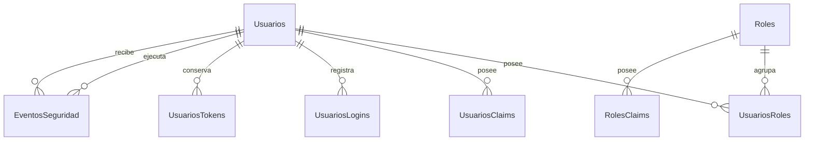
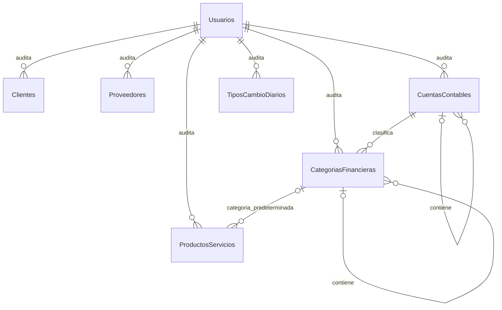

# Modelo de datos

## Convenciones iniciales

- Llaves primarias nuevas: `uniqueidentifier`/`Guid`.
- Tablas de seguridad: esquema SQL `seguridad`.
- Catálogos de partes y clasificación: esquema SQL `catalogos`.
- Tipos de cambio y documentos financieros: esquema SQL `finanzas`.
- Nombres únicos mediante valores normalizados de Identity.
- Precios de referencia: `decimal` con cuatro decimales declarados explícitamente.
- Tipo de cambio: `decimal` con seis decimales declarados explícitamente.
- Código monetario: CRC o USD.
- Instantes técnicos: UTC; fechas de documentos: fecha de negocio sin hora.
- Migraciones en `SistemaFinanciero.Infrastructure/Persistence/Migrations`.
- Códigos de catálogo recortados, normalizados a mayúsculas e indexados de forma única dentro de su
  propia tabla.
- Relaciones históricas y jerárquicas con borrado restringido.

## Esquema de seguridad implementado

La migración `InitialIdentity` crea las tablas de Identity y `AddUserAdministration` incorpora la
bitácora. El esquema resultante contiene:

### Diccionario de tablas

| Tabla | Propósito |
|---|---|
| `seguridad.Usuarios` | Identidad, credenciales hasheadas, bloqueo y estado lógico del usuario. |
| `seguridad.Roles` | Cuatro perfiles internos creados por el bootstrap explícito. |
| `seguridad.UsuariosRoles` | Relación muchos a muchos entre usuarios y roles. |
| `seguridad.UsuariosClaims` | Claims propios de un usuario, reservados para capacidades futuras. |
| `seguridad.RolesClaims` | Claims asociados a roles. |
| `seguridad.UsuariosLogins` | Metadatos de proveedores externos; no se usan en el alcance inicial. |
| `seguridad.UsuariosTokens` | Tokens generados por Identity. |
| `seguridad.EventosSeguridad` | Bitácora append-only de cambios administrativos de acceso, sin secretos. |
| `dbo.__EFMigrationsHistory` | Historial técnico de migraciones aplicadas. |

### `seguridad.Usuarios`

| Campo | Tipo SQL | Nulo | Restricción | Descripción |
|---|---|---:|---|---|
| `Id` | `uniqueidentifier` | No | PK | Identificador estable. |
| `FullName` | `nvarchar(150)` | No | — | Nombre mostrado y utilizado en trazabilidad. |
| `IsActive` | `bit` | No | Predeterminado 1 | Baja lógica; un usuario inactivo no accede. |
| `MustChangePassword` | `bit` | No | Predeterminado 0 | Restringe una contraseña temporal hasta que el propietario la cambia. |
| `UserName` | `nvarchar(256)` | No | Índice único normalizado | En esta versión coincide con el correo. |
| `NormalizedUserName` | `nvarchar(256)` | No | `UserNameIndex` único | Valor normalizado por Identity. |
| `Email` | `nvarchar(256)` | No | — | Correo utilizado para iniciar sesión. |
| `NormalizedEmail` | `nvarchar(256)` | No | `EmailIndex` único | Evita duplicados aun bajo concurrencia. |
| `EmailConfirmed` | `bit` | No | — | Marcador técnico; no hay servicio de correo. |
| `PasswordHash` | `nvarchar(max)` | Sí | — | Hash administrado exclusivamente por Identity. |
| `SecurityStamp` | `nvarchar(max)` | Sí | — | Permite invalidar sesiones ante cambios sensibles. |
| `ConcurrencyStamp` | `nvarchar(max)` | Sí | Concurrencia Identity | Detecta cambios concurrentes. |
| `PhoneNumber` | `nvarchar(max)` | Sí | — | Reservado por Identity; sin uso funcional inicial. |
| `PhoneNumberConfirmed` | `bit` | No | — | Reservado por Identity. |
| `TwoFactorEnabled` | `bit` | No | — | Reservado; MFA no forma parte del primer incremento. |
| `LockoutEnd` | `datetimeoffset` | Sí | — | Fin de un bloqueo temporal. |
| `LockoutEnabled` | `bit` | No | — | Habilita el control de intentos fallidos. |
| `AccessFailedCount` | `int` | No | — | Intentos fallidos acumulados por Identity. |

Las tablas auxiliares conservan las claves y relaciones definidas por ASP.NET Core Identity. Su esquema
exacto y reproducible está en la migración versionada; no deben editarse manualmente en SQL Server.

`ConcurrencyStamp` se presenta a la interfaz únicamente como una versión opaca. No se confunde con
`SecurityStamp`: el primero detecta formularios administrativos obsoletos y el segundo invalida cookies
después de cambios sensibles.

### `seguridad.EventosSeguridad`

| Campo | Tipo SQL | Nulo | Restricción | Descripción |
|---|---|---:|---|---|
| `Id` | `uniqueidentifier` | No | PK | Identificador inmutable del evento. |
| `Action` | `int` | No | Valor enumerado permitido | Alta, edición, rol, estado, contraseña, desbloqueo o bootstrap. |
| `ActorUserId` | `uniqueidentifier` | Sí | FK restrictiva | Administrador o propietario que ejecutó la acción; nulo solo para bootstrap. |
| `TargetUserId` | `uniqueidentifier` | No | FK restrictiva | Cuenta afectada por la acción. |
| `OccurredAtUtc` | `datetimeoffset` | No | UTC | Instante en que la transacción confirmó el cambio. |
| `Role` | `nvarchar(32)` | Sí | Rol fijo permitido | Rol nuevo cuando la acción necesita conservarlo. |

La entidad no posee operaciones de actualización o eliminación y no incluye campos para contraseña,
hash, token, correo, identificación ni información financiera. Los índices por instante, actor y
objetivo preparan la consulta futura de auditoría sin ampliar este incremento con un módulo de reportes.

## Modelo del incremento de catálogos

Cliente y proveedor son entidades separadas según ADR-0006. Las tablas financieras no almacenan
asientos contables, inventario ni un saldo editable de cuenta.

Cada relación de auditoría representa las referencias de creación y última modificación hacia
`seguridad.Usuarios`; nunca provoca borrado en cascada.

### Diccionario de tablas del incremento

| Tabla | Propósito |
|---|---|
| `catalogos.Clientes` | Personas u organizaciones a las que se puede facturar. |
| `catalogos.Proveedores` | Personas u organizaciones asociadas a gastos futuros. |
| `catalogos.ProductosServicios` | Catálogo facturable unificado, sin existencias de inventario. |
| `catalogos.CategoriasFinancieras` | Clasificación jerárquica de ingreso o gasto. |
| `catalogos.CuentasContables` | Catálogo jerárquico de cuentas de clasificación; incluye las cajas y bancos como cuentas de efectivo. |
| `finanzas.TiposCambioDiarios` | Una tasa manual CRC por USD para cada fecha de negocio. |

### Campos comunes auditables

Clientes, proveedores, productos/servicios, categorías y cuentas comparten conceptualmente:

| Campo | Tipo SQL | Nulo | Restricción | Descripción |
|---|---|---:|---|---|
| `Id` | `uniqueidentifier` | No | PK | Identificador técnico estable. |
| `IsActive` | `bit` | No | Predeterminado 1 | Baja lógica; no elimina historia. |
| `CreatedAtUtc` | `datetimeoffset` | No | UTC | Instante de creación. |
| `CreatedByUserId` | `uniqueidentifier` | No | FK restrictiva | Usuario creador. |
| `UpdatedAtUtc` | `datetimeoffset` | No | UTC | Instante del último cambio. |
| `UpdatedByUserId` | `uniqueidentifier` | No | FK restrictiva | Usuario responsable del último cambio. |
| `RowVersion` | `rowversion` | No | Concurrencia | Evita sobrescrituras silenciosas. |

`finanzas.TiposCambioDiarios` posee los mismos campos de auditoría y `RowVersion`, pero no `IsActive`:
una tasa se corrige de forma auditada en la fila única de su fecha.

### `catalogos.Clientes` y `catalogos.Proveedores`

Ambas tablas tienen la misma forma inicial, pero no comparten identidad ni ciclo de vida:

| Campo | Tipo SQL | Nulo | Restricción | Descripción |
|---|---|---:|---|---|
| `Code` | `nvarchar(30)` | No | Único por tabla | Código visible normalizado en mayúsculas. |
| `Name` | `nvarchar(150)` | No | — | Nombre completo o razón social. |
| `Identification` | `nvarchar(50)` | Sí | Único por tabla cuando existe | Identificación fiscal o personal cuando se conoce. |
| `Email` | `nvarchar(254)` | Sí | — | Correo de contacto. |
| `Phone` | `nvarchar(30)` | Sí | — | Teléfono de contacto. |
| `Address` | `nvarchar(500)` | Sí | — | Dirección administrativa. |

La misma identificación puede existir en ambas tablas porque una persona puede cumplir ambos papeles.
Cambiar un registro no actualiza silenciosamente el otro.

### `catalogos.ProductosServicios`

| Campo | Tipo SQL | Nulo | Restricción | Descripción |
|---|---|---:|---|---|
| `Code` | `nvarchar(30)` | No | Único | Código visible normalizado. |
| `Name` | `nvarchar(150)` | No | — | Nombre facturable. |
| `Type` | Valor restringido | No | Producto/Servicio | Clasifica el artículo; no habilita inventario. |
| `Description` | `nvarchar(500)` | Sí | — | Descripción administrativa. |
| `UnitOfMeasure` | `nvarchar(30)` | No | — | Unidad visible para capturas futuras. |
| `ReferencePriceCrc` | `decimal(18,4)` | Sí | Mayor que cero | Precio de referencia en CRC. |
| `ReferencePriceUsd` | `decimal(18,4)` | Sí | Mayor que cero | Precio de referencia en USD. |
| `DefaultIncomeCategoryId` | `uniqueidentifier` | Sí | FK restrictiva | Categoría activa de ingreso sugerida; no obliga documentos futuros. |

Ambos precios pueden ser nulos para servicios de precio variable. Cuando existe un precio se conserva
con cuatro decimales; el redondeo del total monetario se realizará al crear documentos.

### `catalogos.CategoriasFinancieras`

| Campo | Tipo SQL | Nulo | Restricción | Descripción |
|---|---|---:|---|---|
| `Code` | `nvarchar(30)` | No | Único | Código visible normalizado. |
| `Name` | `nvarchar(120)` | No | — | Nombre de la categoría. |
| `Kind` | Valor restringido | No | Ingreso/Gasto; inmutable | Naturaleza financiera administrativa. |
| `ParentId` | `uniqueidentifier` | Sí | FK autorreferente restrictiva | Categoría padre del mismo tipo. |
| `LedgerAccountId` | `uniqueidentifier` | No | FK restrictiva a `catalogos.CuentasContables` (`FK_CategoriasFinancieras_CuentasContables`) | Cuenta contable de la categoría, del tipo Ingreso para las de ingreso y Gasto para las de gasto. |
| `Description` | `nvarchar(300)` | Sí | — | Explicación de uso. |

La aplicación impide autorreferencias, ciclos y padres de un tipo distinto. También bloquea la baja de
una categoría con hijas activas o artículos activos que la usan, y exige un padre activo al reactivar
una hija. No hay desactivación en cascada. La base restringe el borrado para conservar la jerarquía.
Que la cuenta sea del tipo que corresponde a la naturaleza lo valida la aplicación, porque involucra dos
tablas: como ni la naturaleza de la categoría ni el tipo de la cuenta pueden cambiar, la relación se
mantiene coherente después de validarla al asignarla.

### `catalogos.CuentasContables`

Comparte los campos comunes auditables de los catálogos: `Id`, `IsActive`, `CreatedAtUtc`,
`CreatedByUserId`, `UpdatedAtUtc`, `UpdatedByUserId` y `RowVersion` (ADR-0012).

| Campo | Tipo SQL | Nulo | Restricción | Descripción |
|---|---|---:|---|---|
| `Code` | `nvarchar(30)` | No | Único (`UX_CuentasContables_Code`); no vacío | Código visible normalizado en mayúsculas. |
| `Name` | `nvarchar(120)` | No | — | Nombre de la cuenta. |
| `Type` | Entero | No | 1 = Activo, 2 = Pasivo, 3 = Patrimonio, 4 = Ingreso, 5 = Gasto; inmutable | Naturaleza de la cuenta. |
| `ParentId` | `uniqueidentifier` | Sí | FK autorreferente restrictiva; distinta de `Id` | Cuenta superior del mismo tipo, sin ciclos. |
| `CashKind` | Entero | Sí | 1 = Caja, 2 = Banco; inmutable | Subtipo cuando la cuenta es de efectivo; nulo en las demás. |
| `Currency` | `char(3)` | Sí | CRC o USD; inmutable | Moneda exclusiva de una cuenta de efectivo; nula en las demás. |
| `Reference` | `nvarchar(100)` | Sí | — | Referencia no sensible; no debe almacenar credenciales bancarias. |
| `Description` | `nvarchar(300)` | Sí | — | Explicación de uso. |

`CK_CuentasContables_Cash` exige que `CashKind` y `Currency` estén ambos presentes o ambos ausentes, y que
una cuenta de efectivo sea de tipo Activo. Las demás restricciones `CHECK` cubren el código no vacío, los
valores permitidos de `Type`, `CashKind` y `Currency`, y que una cuenta no sea su propia superior. La
aplicación además valida que la cuenta superior esté activa, sea del mismo tipo, no sea de efectivo y no
produzca ciclos.

No existe un campo `Balance`: los saldos se calcularán en un incremento transaccional desde movimientos
confirmados y saldos iniciales controlados. La tabla anterior `finanzas.CuentasFinancieras` se migró aquí
y se eliminó (ADR-0012).

### `catalogos.TiposRetencion`

Catálogo de retenciones con tarifa porcentual (ADR-0013), complemento de `catalogos.TiposImpuesto`.
Comparte los campos comunes auditables de los catálogos: `Id`, `IsActive`, `CreatedAtUtc`,
`CreatedByUserId`, `UpdatedAtUtc`, `UpdatedByUserId` y `RowVersion`.

| Campo | Tipo SQL | Nulo | Restricción | Descripción |
|---|---|---:|---|---|
| `Code` | `nvarchar(30)` | No | Único (`UX_TiposRetencion_Code`); no vacío | Código visible normalizado en mayúsculas. |
| `Name` | `nvarchar(120)` | No | — | Nombre de la retención. |
| `Rate` | `decimal(18,4)` | No | Entre 0 y 100 (`CK_TiposRetencion_Rate`) | Porcentaje de retención. |
| `Description` | `nvarchar(300)` | Sí | — | Explicación de uso. |

A diferencia de `TiposImpuesto`, no tiene columna de método de cálculo: una retención es siempre
porcentual. La base y el monto de una retención concreta no se guardan aquí, porque dependen del abono o
el pago al que se aplique; ese registro se construirá junto con los abonos y pagos.

### `finanzas.ParametrosSistema` y `finanzas.ParametrosSistemaHistorial`

Cubren las reglas de negocio 7 y 9 (ADR-0014). No son un catálogo: `ParametrosSistema` admite como
máximo una fila, con el identificador fijo `00000000-0000-0000-0000-000000000001`, y no tiene baja
lógica.

| Campo (`ParametrosSistema`) | Tipo SQL | Nulo | Restricción | Descripción |
|---|---|---:|---|---|
| `Id` | `uniqueidentifier` | No | PK; siempre el identificador fijo | Fila única de parámetros. |
| `AuthorizationLimitCrc` | `decimal(18,2)` | No | Mayor o igual que cero (`CK_ParametrosSistema_AuthorizationLimit`) | Límite en CRC; los abonos y pagos por encima solo los registra Gerencia. |
| `OverdueAlertDays` | `int` | No | Mayor que cero (`CK_ParametrosSistema_OverdueAlertDays`) | Días de anticipación para la alerta de vencimiento próximo. |
| `CreatedAtUtc`, `CreatedByUserId`, `UpdatedAtUtc`, `UpdatedByUserId`, `RowVersion` | Como los campos comunes | No | FK restrictivas a usuarios | Auditoría y concurrencia. |

`ParametrosSistemaHistorial` es de solo inserción, igual que `seguridad.EventosSeguridad`; la aplicación
lo protege contra modificaciones y borrados (`FinancialDbContext.EnsureAppendOnlyLogsAreNotMutated`).

| Campo (`ParametrosSistemaHistorial`) | Tipo SQL | Nulo | Restricción | Descripción |
|---|---|---:|---|---|
| `Id` | `uniqueidentifier` | No | PK | Identificador del registro de cambio. |
| `PreviousAuthorizationLimitCrc` | `decimal(18,2)` | Sí | `>= 0` cuando existe | Límite anterior; nulo solo en el registro de la primera configuración. |
| `NewAuthorizationLimitCrc` | `decimal(18,2)` | No | `>= 0` | Límite nuevo. |
| `PreviousOverdueAlertDays` | `int` | Sí | `> 0` cuando existe | Días de alerta anteriores; nulos en la primera configuración. |
| `NewOverdueAlertDays` | `int` | No | `> 0` | Días de alerta nuevos. |
| `ChangedAtUtc` | `datetimeoffset` | No | Índice `IX_ParametrosSistemaHistorial_ChangedAtUtc` | Instante del cambio. |
| `ChangedByUserId` | `uniqueidentifier` | No | FK restrictiva | Usuario de Gerencia que hizo el cambio. |

### `finanzas.TiposCambioDiarios`

| Campo | Tipo SQL | Nulo | Restricción | Descripción |
|---|---|---:|---|---|
| `Id` | `uniqueidentifier` | No | PK | Identificador técnico estable. |
| `EffectiveDate` | `date` | No | Único | Fecha de negocio de la tasa. |
| `CrcPerUsd` | `decimal(18,6)` | No | Mayor que cero | CRC equivalentes a un USD. |
| `Source` | `nvarchar(100)` | No | Requerido por dominio y aplicación | Fuente informada durante el registro manual. |
| `Notes` | `nvarchar(300)` | Sí | — | Aclaración opcional. |
| `CreatedAtUtc` | `datetimeoffset` | No | UTC | Instante de creación. |
| `CreatedByUserId` | `uniqueidentifier` | No | FK restrictiva | Usuario creador. |
| `UpdatedAtUtc` | `datetimeoffset` | No | UTC | Instante de creación o corrección más reciente. |
| `UpdatedByUserId` | `uniqueidentifier` | No | FK restrictiva | Usuario responsable del último cambio. |
| `RowVersion` | `rowversion` | No | Concurrencia | Detecta correcciones simultáneas. |

La unicidad de `EffectiveDate` asegura una sola tasa operativa diaria. Los documentos futuros copiarán
la tasa utilizada y no dependerán de una consulta histórica mutable.

## Incremento de facturación

Las facturas son documentos administrativos internos (ADR-0009 y ADR-0010). Tienen tres tablas en el
esquema `finanzas`. Los valores de los estados y las monedas se guardan como enteros restringidos.

| Tabla | Propósito |
|---|---|
| `finanzas.Facturas` | Encabezado: cliente, fechas, moneda, condición de pago, estado y totales. |
| `finanzas.FacturaLineas` | Líneas de productos o servicios con su descripción, cantidades e importes. |
| `finanzas.FacturaLineaImpuestos` | Fotografía de cada impuesto aplicado a una línea. |

### `finanzas.Facturas`

| Campo | Tipo SQL | Nulo | Restricción | Descripción |
|---|---|---:|---|---|
| `Id` | `uniqueidentifier` | No | PK | Identificador técnico estable. |
| `Number` | `bigint` identidad | No | Único (`UX_Facturas_Number`) | Consecutivo interno; no es numeración fiscal. |
| `CustomerId` | `uniqueidentifier` | No | FK restrictiva a `catalogos.Clientes` | Cliente facturado. |
| `IssueDate` | `date` | No | — | Fecha de negocio; editable solo en borrador. |
| `Currency` | Entero | No | 1 = CRC, 2 = USD | Moneda única de la factura; no cambia si hay líneas. |
| `PaymentTerm` | Entero | No | 1 = contado, 2 = crédito | Condición de pago. |
| `DueDate` | `date` | Sí | Ver abajo | Vencimiento; solo existe en facturas a crédito. |
| `Status` | Entero | No | 1 = borrador, 2 = confirmada, 3 = anulada | Estado del documento. |
| `GrossAmount` | `decimal(18,2)` | No | Mayor o igual que cero | Total antes de descuentos e impuestos. |
| `DiscountAmount` | `decimal(18,2)` | No | Mayor o igual que cero | Total de descuentos. |
| `NetAmount` | `decimal(18,2)` | No | Mayor o igual que cero | Total antes de impuestos. |
| `TaxAmount` | `decimal(18,2)` | No | Mayor o igual que cero | Total de impuestos. |
| `TotalAmount` | `decimal(18,2)` | No | Mayor o igual que cero | Total a cobrar. |
| `ConfirmedCrcPerUsd` | `decimal(18,6)` | Sí | Obligatoria y positiva si es USD y no es borrador | Tasa CRC por USD fijada al confirmar. |
| `ConfirmedAtUtc`, `ConfirmedByUserId` | `datetimeoffset`, `uniqueidentifier` | Sí | FK restrictiva a usuarios | Confirmación. |
| `CancellationReason`, `CancelledAtUtc`, `CancelledByUserId` | `nvarchar(300)`, `datetimeoffset`, `uniqueidentifier` | Sí | FK restrictiva a usuarios | Anulación con motivo. |
| `CreatedAtUtc`, `CreatedByUserId`, `UpdatedAtUtc`, `UpdatedByUserId` | Como los campos comunes | No | FK restrictivas a usuarios | Auditoría. |
| `RowVersion` | `rowversion` | No | Concurrencia | Evita sobrescrituras silenciosas. |

Restricciones `CHECK` de la tabla:
- `CK_Facturas_PaymentTerm`: la condición de pago es 1 o 2.
- `CK_Facturas_DueDate`: una factura de contado no tiene vencimiento; una a crédito lo tiene y no es
  anterior a `IssueDate`.
- `CK_Facturas_Status`, `CK_Facturas_Currency`, `CK_Facturas_Totals` y `CK_Facturas_UsdRate`.

Índices: `IX_Facturas_Status_IssueDate` y `IX_Facturas_CustomerId_Status`. Como las facturas no se
eliminan, no existe un campo de baja lógica: su ciclo de vida es el estado.

### `finanzas.FacturaLineas`

| Campo | Tipo SQL | Nulo | Restricción | Descripción |
|---|---|---:|---|---|
| `Id` | `uniqueidentifier` | No | PK | Identificador técnico de la línea. |
| `InvoiceId` | `uniqueidentifier` | No | FK en cascada a `Facturas` | Factura de origen. |
| `Position` | `int` | No | Mayor que cero; único por factura (`UX_FacturaLineas_InvoiceId_Position`) | Posición consecutiva desde 1 que conserva el orden de captura. |
| `CatalogItemId` | `uniqueidentifier` | Sí | FK restrictiva a `catalogos.ProductosServicios` | Artículo de origen; nulo en ventas no catalogadas. |
| `Description` | `nvarchar(300)` | No | — | Descripción conservada aunque el catálogo cambie. |
| `UnitOfMeasure` | `nvarchar(30)` | No | — | Unidad conservada. |
| `Quantity` | `decimal(18,4)` | No | Mayor que cero | Cantidad facturada. |
| `UnitPrice` | `decimal(18,4)` | No | Mayor o igual que cero | Precio unitario sin impuesto incluido. |
| `GrossAmount` | `decimal(18,2)` | No | Mayor o igual que cero | Cantidad por precio, redondeado. |
| `DiscountAmount` | `decimal(18,2)` | No | Entre cero y el bruto | Descuento monetario de la línea. |
| `NetAmount` | `decimal(18,2)` | No | Mayor o igual que cero | Bruto menos descuento; base gravable. |
| `TaxAmount` | `decimal(18,2)` | No | Mayor o igual que cero | Suma de los impuestos de la línea. |
| `TotalAmount` | `decimal(18,2)` | No | Mayor o igual que cero | Neto más impuestos. |

La cascada existe para que reemplazar o quitar una línea de un borrador elimine también sus impuestos;
la aplicación nunca elimina facturas. La línea es inmutable: modificarla se hace reemplazándola por otra
con un identificador nuevo, que ocupa la misma posición. Al quitar una línea se renumeran las
siguientes para que las posiciones sigan siendo consecutivas.

### `finanzas.FacturaLineaImpuestos`

| Campo | Tipo SQL | Nulo | Restricción | Descripción |
|---|---|---:|---|---|
| `Id` | `uniqueidentifier` | No | PK | Identificador técnico de la fotografía. |
| `InvoiceLineId` | `uniqueidentifier` | No | FK en cascada a `FacturaLineas` | Línea a la que pertenece. |
| `TaxTypeId` | `uniqueidentifier` | Sí | FK restrictiva a `catalogos.TiposImpuesto` (`FK_FacturaLineaImpuestos_TiposImpuesto`) | Tipo de impuesto del catálogo de origen; nulo si no se usó uno. |
| `Code` | `nvarchar(30)` | No | Único por línea (`UX_FacturaLineaImpuestos_Line_Code`) | Código del impuesto, normalizado en mayúsculas. |
| `Name` | `nvarchar(120)` | No | — | Nombre del impuesto al aplicarlo. |
| `CalculationType` | Entero | No | 1 = porcentaje, 2 = monto fijo por unidad | Método de cálculo. |
| `Rate` | `decimal(18,4)` | No | Mayor o igual que cero | Porcentaje o monto por unidad utilizado. |
| `TaxableAmount` | `decimal(18,2)` | No | Mayor o igual que cero | Base gravable: el neto de la línea. |
| `Amount` | `decimal(18,2)` | No | Mayor o igual que cero | Impuesto calculado y redondeado. |

Los cambios posteriores del catálogo de impuestos no alteran estas filas: código, nombre, método,
tarifa, base y monto son una copia. `TaxTypeId` solo registra de qué tipo del catálogo provienen y, al
ser restrictiva, impide eliminar un tipo que ya se usó.

### `catalogos.TiposImpuesto`

Catálogo de impuestos con tarifa configurable (ADR-0011). Comparte los campos comunes auditables de los
catálogos: `Id`, `IsActive`, `CreatedAtUtc`, `CreatedByUserId`, `UpdatedAtUtc`, `UpdatedByUserId` y
`RowVersion`.

| Campo | Tipo SQL | Nulo | Restricción | Descripción |
|---|---|---:|---|---|
| `Code` | `nvarchar(30)` | No | Único (`UX_TiposImpuesto_Code`); no vacío | Código visible normalizado en mayúsculas. |
| `Name` | `nvarchar(120)` | No | — | Nombre del impuesto. |
| `CalculationType` | Entero | No | 1 = porcentaje, 2 = monto fijo por unidad; inmutable | Método de cálculo. |
| `Rate` | `decimal(18,4)` | No | Mayor o igual que cero; hasta 100 si es porcentaje (`CK_TiposImpuesto_Rate`) | Porcentaje o monto por unidad. |
| `Description` | `nvarchar(300)` | Sí | — | Explicación de uso. |

Índice `IX_TiposImpuesto_IsActive_Name` para los listados. Un tipo con tarifa cero representa los
impuestos exentos o de tarifa 0 %, que se distinguen por su código y nombre. Las claves foráneas de
auditoría no provocan borrado en cascada y no existe eliminación física: se usa la baja lógica.

## Estado de la base de desarrollo

El 22 de agosto de 2026 se verificó en `.\SQLEXPRESS`:

- base `SistemaFinanciero_Dev`;
- ocho tablas en el esquema `seguridad`;
- cuatro tablas en el esquema `catalogos` y dos tablas en el esquema `finanzas`;
- migraciones `InitialIdentity`, `AddBusinessCatalogs` y `AddUserAdministration` aplicadas con EF Core
  10.0.11;
- trece restricciones `CHECK`, ocho índices únicos, catorce claves foráneas y seis columnas
  `rowversion` en las tablas del incremento de catálogos;
- una tabla, una columna, cuatro restricciones `CHECK`, un índice único de rol y dos claves foráneas
  restrictivas agregadas por el incremento de usuarios;
- modelo de EF Core sincronizado con la última migración.

Los escenarios transaccionales de integración se ejecutaron dentro de transacciones revertidas. La
verificación posterior confirmó que no quedaron clientes, proveedores, productos/servicios,
categorías, cuentas, tasas, usuarios, roles, asignaciones ni eventos de seguridad de prueba en la base
de desarrollo.
